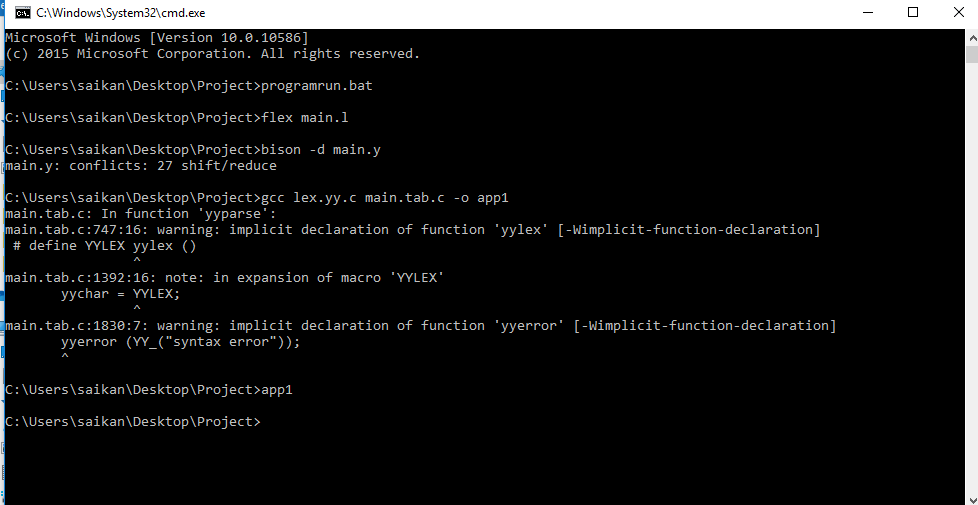

# Compiler_Design_Project
## Procedure
First, you have to install flex in  C drive.

Download link for flex: https://sourceforge.net/projects/gnuwin32/files/flex/2.5.4a-1/flex-2.5.4a-1.exe/download?use_mirror=vorboss&download=

Then you have to set Environment variable in your computer. ALso Set the Codeblocks environment variable (check whether the codeblocks have compiler or not)


The Install Bison in C drive.

Download link: https://sourceforge.net/projects/gnuwin32/files/bison/2.4.1/bison-2.4.1-setup.exe/download?use_mirror=netcologne

then Run the project using programrun.bat.Click this file ,the automatically Run the project and a black command window will be open like below:


## Sample Input

```Bangla
#include<mathematical.h>
#include<exchangeInfo.h>
#include<math.h>

main:
{
 

	//Variable declaration

	CHAR p,q,r;
	INTEGER a,b,c;
	FLOAT x,y,z;
	A INTEGER N (10);
	A CHAR C (5);

	// variable assignment

	a=60;
	b=30;
	c=0;
	
	c=a+b;
	
	c=a-b;

	c=a*b;


	

	// if else block

	IF(5>2)
	{
		23-30;
	}
	ELSE
	{
		20+9;
	}


	// IF ELSE Block

	IF(40<30)
	{
		40+30;
	}
	ELSE IF(30>70) {
		a-b;
	}
	
	ELSE
	{
		b-a;
	}
	

	// factorial calculation
	FACTORIAL(5);

	// Odd Even calculation
 	ODDEVEN(10);


 	// While Loop Block
	WHILE (1<3)
	{

		10+13;


	}

	WHILE(1<4)
	{
		2^4;
	}


	// Mathematical Expression
	
	LOG(16);
	
	SIN(30);

	// Print Fnction
	PRINT (10+15);

	// For Loop block
	LOOP (1,4,1)
	{
		a+b;
	}

	// Switch Case
	
	SWITCH (2) 
	{
	CASE 1: 10+20;

	CASE 2: 33-19;

	DEFAULT : 22-15;
	
	}
}
```
## Sample Output
```

Header file found :
#include<mathematical.h>

Header file found :
#include<exchangeInfo.h>

Header file found :
#include<math.h>

main function strat

Single line comment found :: //Variable declaration
char declaration : 
p q r interger declaration : 
a b c float declaration : 
x y z interger declaration : 
N Size of the ARRAY is : 10
char declaration : 
C Size of the ARRAY is : 5

Single line comment found :: // variable assignment
a 
 variable value: 60

b 
 variable value: 30

c 
 variable value: 0

c a b 
Addition : 90 

 variable value: 90

c a b 
Subtraction :30 
 
 variable value: 30

c a b 
Multiplication :1800 
 
 variable value: 1800


Single line comment found :: // if else block

Greater than :5 > 2 
 
Subtraction :-7 
 IF EXECUTED

Addition : 29 

Single line comment found :: // IF ELSE Block

Less Than :40 < 30 

Addition : 70 

Greater than :30 > 70 
 a b 
Subtraction :30 
 b a 
Subtraction :-30 
 
Single line comment found :: // factorial calculation
FACTORIAL of 5 is : 120


Single line comment found :: // Odd Even calculation
Odd Even Number detection 
Number : 10 is -> Even


Single line comment found :: // While Loop Block

Addition : 23 
 expression: 23


WHILE Loop execution

loop iteration : 1 expression value: 23 

loop iteration : 2 expression value: 23 


Power  :2 ^ 4 
 expression: 16


WHILE Loop execution

loop iteration : 1 expression value: 16 

loop iteration : 2 expression value: 16 

loop iteration : 3 expression value: 16 


Single line comment found :: // Mathematical Expression

Value of Log(16) is : 2.772589
 expression: 2


Value of SIN(30) is : 0.500001
 expression: 0


Single line comment found :: // Print Fnction

Addition : 25 

Print : 25


Single line comment found :: // For Loop block
a b 
Addition : 90 
 expression: 90


 FOR loop iteration  i: 1 expression value : 90

 FOR loop iteration  i: 2 expression value : 90

 FOR loop iteration  i: 3 expression value : 90


Single line comment found :: // Switch Case
Switch Case :: 2

Addition : 30 
Case No : 1 & expression value :30 

Subtraction :14 
 Case No : 2 & expression value :14 
switch case matched

Subtraction :7 
 
Default case & expression value : 7
Main function END


 
