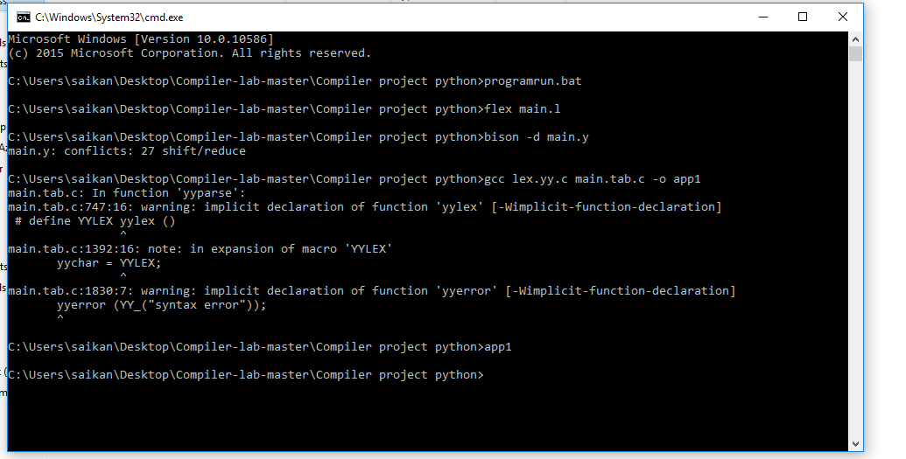

# Compiler_Design_Project
first, you have to install flex in  C drive.

download link for flex: https://sourceforge.net/projects/gnuwin32/files/flex/2.5.4a-1/flex-2.5.4a-1.exe/download?use_mirror=vorboss&download=

Then you have to set Environment variable in your computer. ALso Set the Codeblocks environment variable (check whether the codeblocks have compiler or not)


the Install Bison in C drive.

download link: https://sourceforge.net/projects/gnuwin32/files/bison/2.4.1/bison-2.4.1-setup.exe/download?use_mirror=netcologne

then Run the project using programrun.bat.Click this file ,the automatically Run the project and a black command window will be open like below:


## Sample Input

```Bangla
#include<mathematical.h>
#include<exchangeInfo.h>
#include<math.h>

main:
{
 

	//Variable declaration

	CHAR p,q,r;
	INTEGER a,b,c;
	FLOAT x,y,z;
	A INTEGER N (10);
	A CHAR C (5);

	// variable assignment

	a=60;
	b=30;
	c=0;
	
	c=a+b;
	
	c=a-b;

	c=a*b;


	

	// if else block

	IF(5>2)
	{
		23-30;
	}
	ELSE
	{
		20+9;
	}


	// IF ELSE Block

	IF(40<30)
	{
		40+30;
	}
	ELSE IF(30>70) {
		a-b;
	}
	
	ELSE
	{
		b-a;
	}
	

	// factorial calculation
	FACTORIAL(5);

	// Odd Even calculation
 	ODDEVEN(10);


 	// While Loop Block
	WHILE (1<3)
	{

		10+13;


	}

	WHILE(1<4)
	{
		2^4;
	}


	// Mathematical Expression
	
	LOG(16);
	
	SIN(30);

	// Print Fnction
	PRINT (10+15);

	// For Loop block
	LOOP (1,4,1)
	{
		a+b;
	}

	// Switch Case
	
	SWITCH (2) 
	{
	CASE 1: 10+20;

	CASE 2: 33-19;

	DEFAULT : 22-15;
	
	}

	

	


}	


 


 
