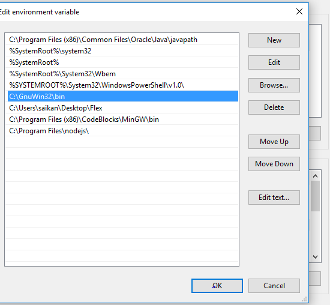

# Compiler_Design_Project
first, you have to install flex in  C drive.

download link for flex: https://sourceforge.net/projects/gnuwin32/files/flex/2.5.4a-1/flex-2.5.4a-1.exe/download?use_mirror=vorboss&download=

Then you have to set Environment variable in your computer. ALso Set the Codeblocks environment variable (check the codeblocks have compiler or not)

the Install Bison in C drive.

download link: https://sourceforge.net/projects/gnuwin32/files/bison/2.4.1/bison-2.4.1-setup.exe/download?use_mirror=netcologne

 

 
